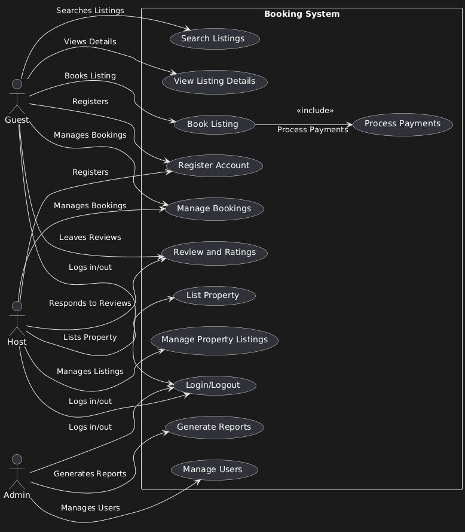

# Requirement Analysis in Software Development

This repository is focused on understanding and implementing the principles of Requirement Analysis, a crucial phase in the Software Development Lifecycle (SDLC). The purpose of this repository is to guide me through structured tasks to document, analyze, and structure software requirements effectively.

---

## What is Requirement Analysis?

Requirement Analysis is a critical phase in the software development lifecycle (SDLC) where the needs and expectations of stakeholders are gathered, analyzed, and documented. This process ensures a clear understanding of what the software should accomplish and helps establish a foundation for the design, development, and testing stages.

### Importance of Requirement Analysis:
1. **Clarity and Understanding**: Defines the project scope and reduces ambiguity in stakeholder expectations.
2. **Efficient Design and Development**: Provides a solid framework for system design and development teams.
3. **Cost and Time Optimization**: Helps estimate project resources, timeline, and budget accurately.
4. **Quality Assurance**: Ensures the final product meets customer needs, enhancing satisfaction and reliability.
5. **Prevents Scope Creep**: By clearly defining boundaries, it avoids unplanned expansions in project requirements.

---

## **Why is Requirement Analysis Important?**

1. **Improves Project Clarity**: Establishes a mutual understanding among stakeholders and the development team, ensuring everyone is aligned with the project goals and scope.

2. **Enhances Planning and Estimation**: Facilitates accurate estimation of resources, budget, and timelines, enabling better project management and risk mitigation.

3. **Ensures High-Quality Output**: By thoroughly understanding and documenting requirements, the final product is more likely to meet user expectations and perform reliably.

4. **Reduces Development Costs**: Early identification of requirements reduces the chances of costly changes during later stages of development.

5. **Supports Better Collaboration**: Provides a clear reference document that helps all teams, from development to QA, work cohesively toward shared goals.

---

## Key Activities in Requirement Analysis

1. **Requirement Gathering**  
   - Conduct interviews with stakeholders to understand their needs and expectations.  
   - Use surveys or questionnaires to collect input from a broader audience.  
   - Organize workshops to gather detailed requirements collaboratively.  
   - Observe end-users in their working environment for insights into real-world needs.  
   - Review existing documentation to understand current functionalities and gaps.  

2. **Requirement Elicitation**  
   - Brainstorm ideas with stakeholders to refine requirements.  
   - Conduct focus group discussions to gather in-depth details.  
   - Use prototyping to help stakeholders visualize the system and finalize their needs.  

3. **Requirement Documentation**  
   - Create detailed requirement specification documents to define all functionalities clearly.  
   - Write user stories to describe requirements from the user's perspective.  
   - Develop use case diagrams to represent interactions between users and the system.  

4. **Requirement Analysis and Modeling**  
   - Prioritize requirements based on their importance and project goals.  
   - Conduct feasibility studies to ensure requirements are technically and financially viable.  
   - Use visual models like data flow diagrams or entity-relationship diagrams for better understanding.  

5. **Requirement Validation**  
   - Review requirements with stakeholders to ensure they are accurate and complete.  
   - Define acceptance criteria to measure when a requirement is successfully met.  
   - Create traceability matrices to track requirements throughout the development lifecycle.  

---

## Types of Requirements

### Functional Requirements

Functional Requirements define the specific behavior or functionalities that the system must perform. These are directly related to user interactions and system operations.

#### Examples for the Booking Management System:
- Users can search for available bookings based on specific dates and locations.
- The system allows users to create, view, update, and cancel bookings.
- Admins can manage user accounts, including activation, deactivation, and role assignments.
- Notifications are sent to users upon successful booking confirmation or cancellation.
- The system generates reports on bookings, cancellations, and revenue.

### Non-functional Requirements

Non-functional Requirements define the system's operational qualities and constraints, focusing on performance, usability, and reliability.

#### Examples for the Booking Management System:
- The system must handle 1,000 simultaneous users without performance degradation.
- Bookings should be confirmed within two seconds after submission.
- The platform must be available 99.9% of the time (uptime).
- The user interface should be mobile-friendly and accessible to screen readers.
- All user data must be encrypted during storage and transmission to ensure privacy.

---

## Use Case Diagrams

Use Case Diagrams are visual representations of the interactions between users (actors) and the system. They help identify and clarify the system's functionality from the user’s perspective and are essential for understanding the scope of the system.

### Benefits of Use Case Diagrams:
- **Clarification**: Helps stakeholders and the development team understand the system’s functional requirements.
- **Communication**: Provides a clear and simple way to communicate system behavior to non-technical stakeholders.
- **Scope Definition**: Defines the boundaries of the system and its interactions with external entities.

### Use Case Diagram for Booking Management System:
The following diagram illustrates the main actors and use cases for the booking management system.

---

## Acceptance Criteria

### Importance of Acceptance Criteria in Requirement Analysis

Acceptance criteria are essential in the requirement analysis phase of software development because they define the specific conditions that must be met for a feature to be considered complete and successful. These criteria provide a clear understanding of the scope of a feature and ensure that all stakeholders—including developers, testers, and product owners—are aligned with the expected outcomes. By establishing acceptance criteria early in the development process, teams can prevent misunderstandings, reduce the risk of scope creep, and ensure that the product meets the desired requirements.

In addition, well-defined acceptance criteria serve as a guide for testing and validation, providing a benchmark for quality assurance teams to verify whether the feature works as intended. Without clear acceptance criteria, the team may face challenges in measuring progress and ensuring that the delivered feature meets business and user needs.

### Example of Acceptance Criteria for the Checkout Feature in the Booking Management System

For the **Checkout** feature in the booking management system, the following acceptance criteria can be defined:

1. **User Authentication**: 
   - The user must be logged in to proceed with the checkout.
   - If the user is not logged in, they should be prompted to log in before continuing.

2. **Booking Confirmation**:
   - The user must confirm the details of the booking (e.g., check-in/check-out dates, property details, guest count) before proceeding to payment.

3. **Payment Processing**:
   - The system should provide a secure payment gateway for the user to enter payment details (e.g., credit card information).
   - Payment should be processed successfully if valid payment details are provided.
   - If the payment fails (e.g., due to insufficient funds or invalid card), the system should show an error message and allow the user to retry.

4. **Booking Confirmation and Receipt**:
   - Once the payment is successful, the user should receive a confirmation page with their booking details.
   - The user should be able to download or receive a booking receipt via email.

5. **Error Handling**:
   - If there is an issue during the checkout process (e.g., payment gateway failure, booking system error), the system should display a clear and informative error message to the user.
   - The system should allow the user to retry the operation or contact support.

6. **Cancellation Option**:
   - After completing the checkout, the user should have the option to cancel the booking within a specified time frame (e.g., 24 hours) without penalty.
   - If the user cancels the booking within the allowed period, the payment should be refunded.

These criteria ensure that the checkout feature meets the user's expectations and works seamlessly within the overall system.

